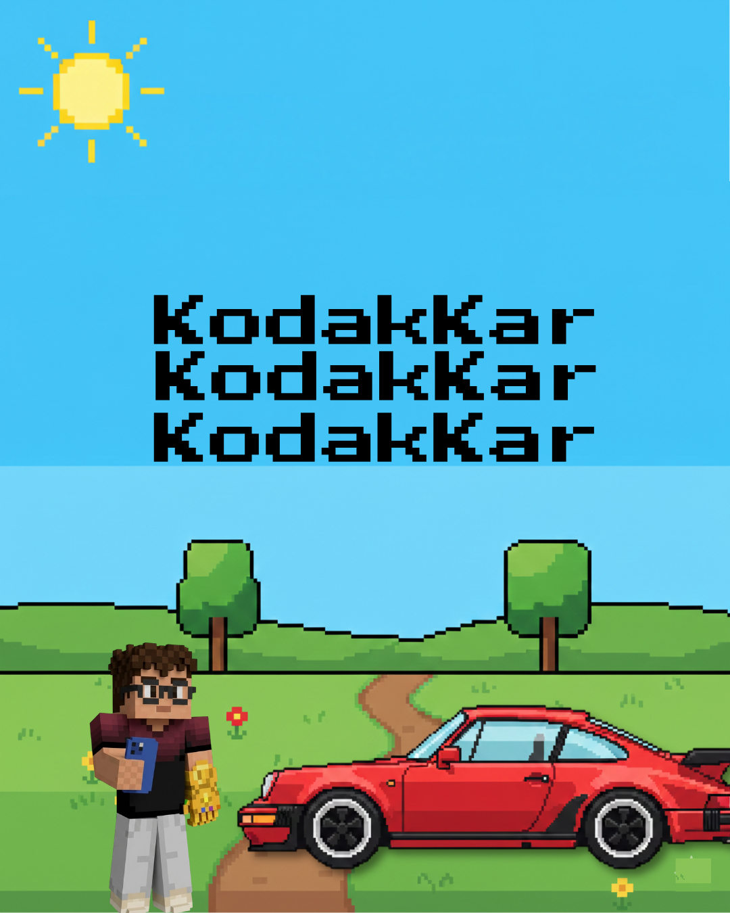

# Kodak Kar — صناعه العبور

## Overview

**Kodak Kars** is a simple arcade-style vertical car game built using **Python + Pygame**.
You control a sports car driving on a multi-lane road, avoid incoming NPC cars, and shoot bullets to clear your path and score points.

This project was made as a **learning-focused game**, The code prioritizes clarity and experimentation over perfection.

No AI was used while building this project.
Yes, that matters.

---

## Core Gameplay

* Player controls a car at the bottom of the screen.
* NPC cars spawn from the top in random lanes.
* Player can:

  * Move left / right
  * Shoot bullets upward
* If the player collides with an NPC:

  * Lose one life
  * Game ends when lives reach zero
* Shooting NPC cars increases score.

---

## Controls

| Key         | Action         |
| ----------- | -------------- |
| LEFT ARROW  | Move car left  |
| RIGHT ARROW | Move car right |
| SPACE       | Fire bullet    |
| Q           | Quit game      |

Mouse click is used to press the **Play** button on the start screen.

---

## Project Structure

```
project/
│
├── assets/
│   ├── background/
│   ├── player_cars/
│   ├── npc_cars/
│   ├── rockets/
│   └── music/
│
├── src/
│   ├── background.py
│   ├── bullets.py
│   ├── button.py
│   ├── car.py
│   ├── core.py 
│   ├── npc_cars.py
│   ├── game_stats.py
│   ├── scoreboard.py
│   └── settings.py
│
└── run_game.py   (KodakKar class)
```

Each file does **one job only**.
---

## Main Game Loop (`KodakKar`)

The game runs inside a classic infinite loop:

1. Handle events (keyboard, mouse, quit)
2. Update game objects **only if the game is active**
3. Draw everything
4. Lock FPS at 60

```python
while True:
    self.check_event()
    if self.game_active:
        self.background.update()
        self.car.update()
        self._update_npc()
        self._update_bullet()
    self.update_screen()
```

Simple. Predictable. Debuggable.

---

## Background System

The background is a **vertically scrolling image** that resets after reaching a certain offset.

Why a counter instead of checking exact Y values?
Because Pygame floats + precision = pain.

Key points:

* Background image is taller than the screen
* Moves downward continuously
* Resets after a fixed number of frames

This avoids seams and weird jumps.

---

## Audio

* Background music auto-plays on startup
* Uses `pygame.mixer`
* Marwan Moussa Song , Cause who does't listen to marwan moussa while driving

---

## Design Decisions

* No inheritance chains → readability > cleverness
* Manual lane positions → better control over visuals
* No physics engine → arcade feel
* Simple assets → focus on mechanics, not graphics

---

## Known Limitations

* No pause system
* No high-score saving
* No difficulty scaling (yet)
* Hard-coded lane values
* No animation system

All of these are **intentional omissions**, not mistakes.

---

## How to Run

1. Install dependencies:

   ```bash
   pip install pygame
   ```
2. Run the game:

   ```bash
   python main.py
   ```

Make sure the `assets/` folder exists exactly as structured.

---

## Final Notes

This project exists to **learn**, not to impress.
It’s readable, modular, and actually understandable after stepping away for a week — which already puts it above half the junk on GitHub.
